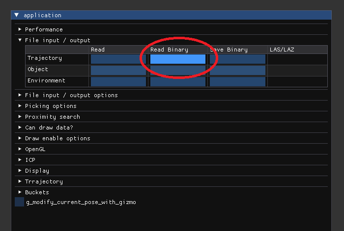
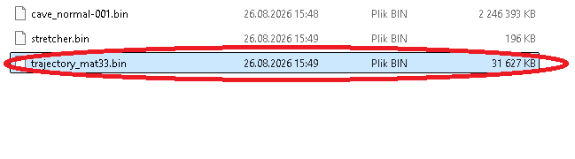
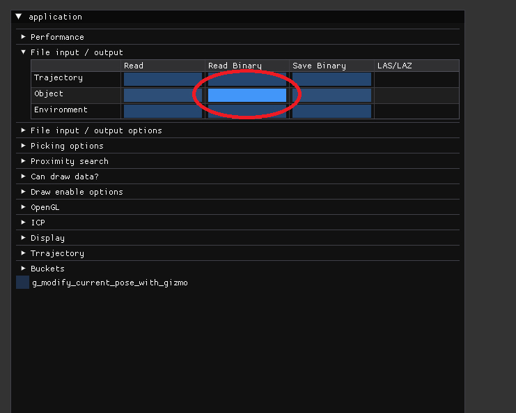
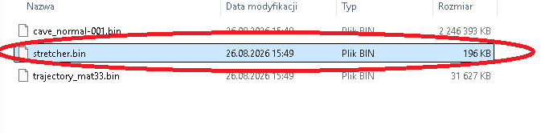
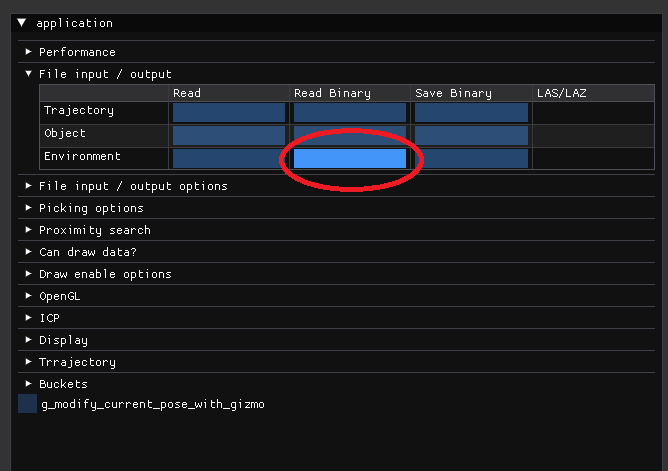
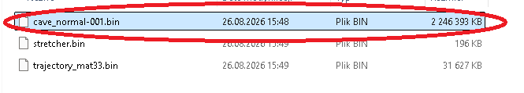
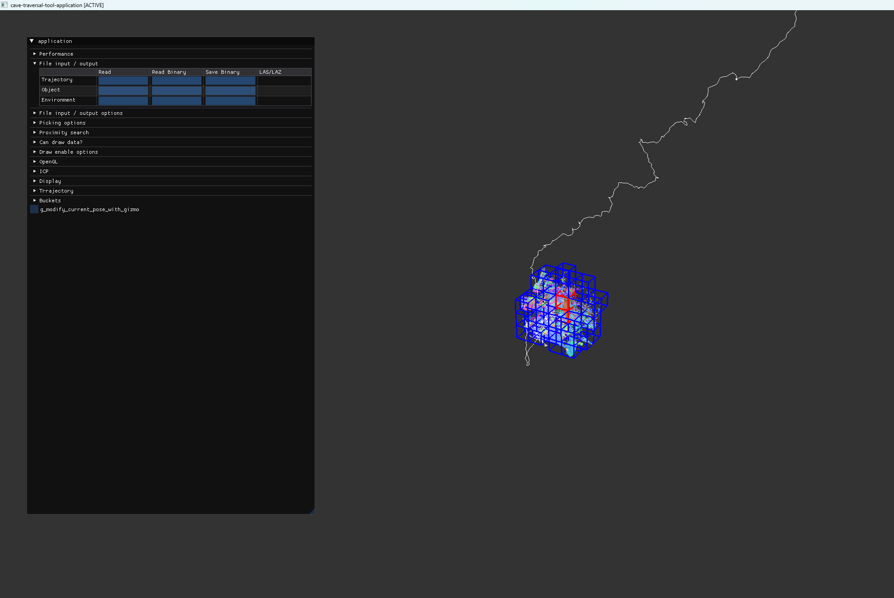
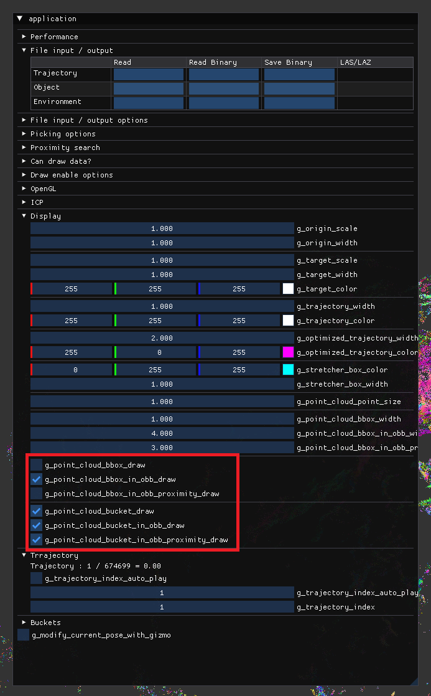
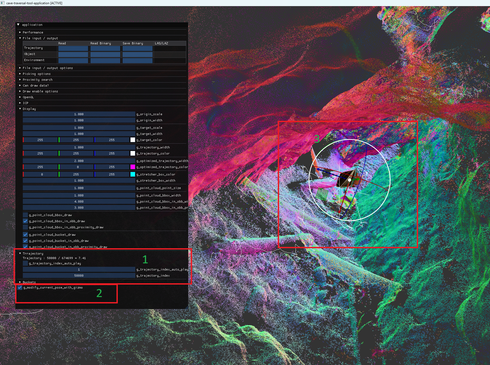
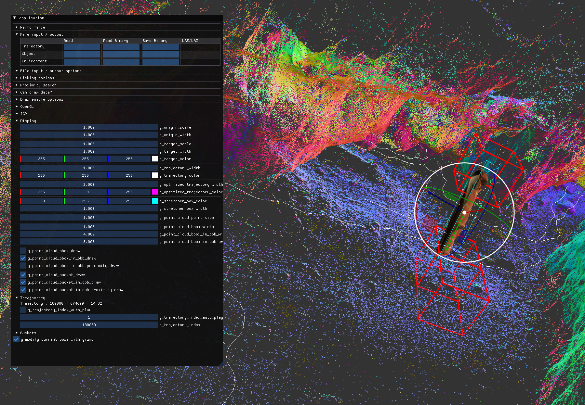

# SearchAndRescue

## Download the data:

You can download data used in this README from [Google drive](https://drive.google.com/drive/folders/18n5jOMeG7KuBFmcrc1OC0CYmQhiqvMrl?usp=sharing)

## Download, build and run:

- NOTE: **assets** directory MUST be in directory that project is ran from - if you wish to run the project by double clicking the built **exe** file you must copy assets **directory** to the location of **cave-traversal-tool.exe**

``` bash
# Download :
git clone --recursive https://github.com/MapsHD/SearchAndRescue.git

# Enter project directory :
cd SearchAndRescue

# Configure project :
cmake -B build -S . -DCMAKE_BUILD_TYPE=Release

# Build :
cmake --build build --config Release -j 8

# Run :
.\build\Release\cave-traversal-tool.exe
```

## Run prebuilt:

``` bash
# Download :
git clone --recursive https://github.com/MapsHD/SearchAndRescue.git

# Enter project directory :
cd SearchAndRescue

# Open *binary* in Windows explorer :
explorer.exe .

# Double click on cave-traversal-tool.exe
```

## Movement:

- __Left mouse button + mouse movement__ - camera rotation
- __Right mouse button + mouse movement__ - moving camera and camera target up / down / left / right in screen space
- __Mouse wheel__ - zoom in / out

## Loading data:

In __File input / output__ select:

- __Trajectory - Read Binary__ and open __trajectory_mat33.bin__ file:





- __Object - Read Binary__ and open __stretcher.bin__ file:





- __Environment - Read Binary__ and open __cave_normal-001.bin__ file:





## View after loading the data:



## Recommended display settings:

- In __Display__ tab tick / untick items as shown:



## Traversing trajectory:

- In __Trajectory__ tab use __g_trajectory_index__ slider to move object through the trajectory points and tick __g_modify_current_pose_with_gizmo__ to enable editing pose using guizmo:



## Viewing collisions:

- When moving object through the trajectory potential collision areas are displayed with red boxes:

