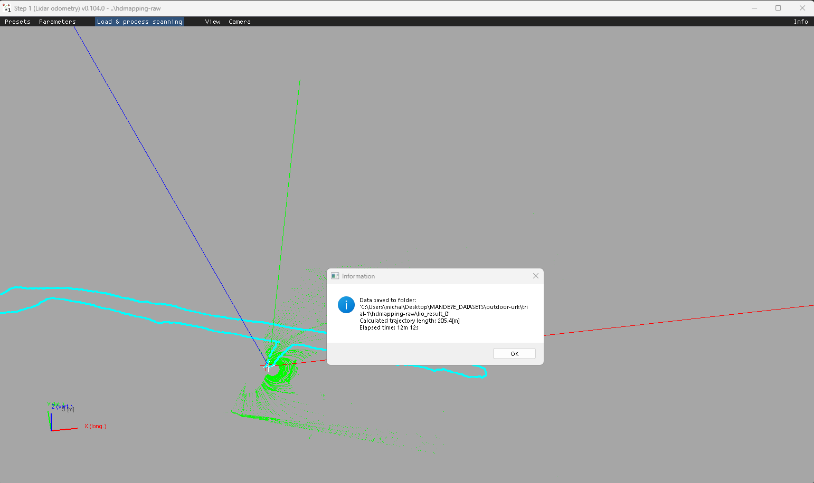
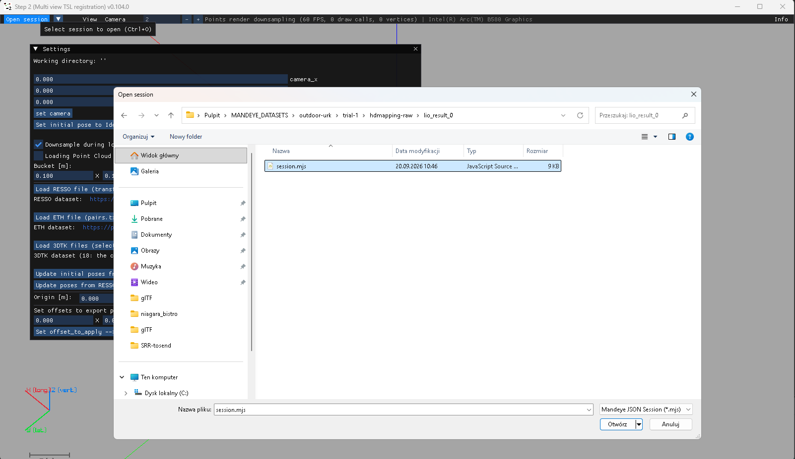
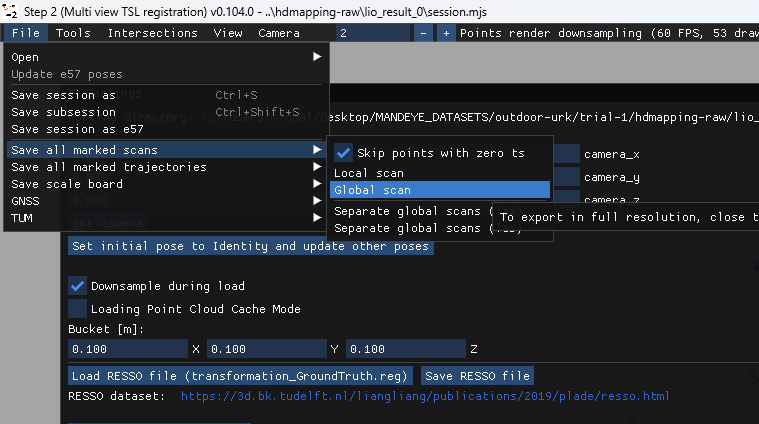
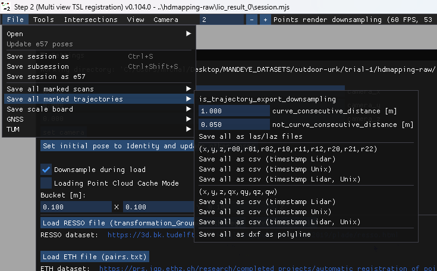
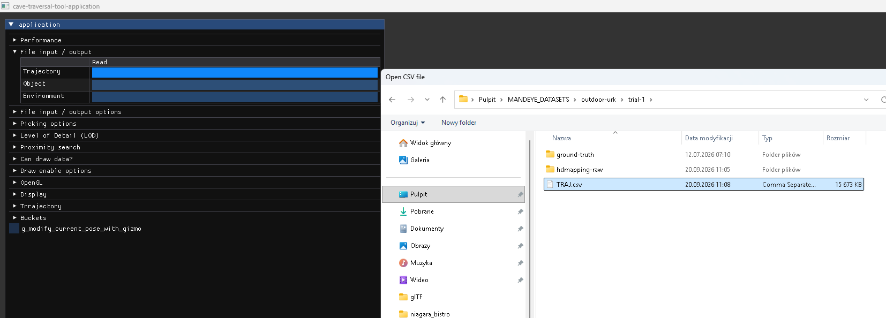
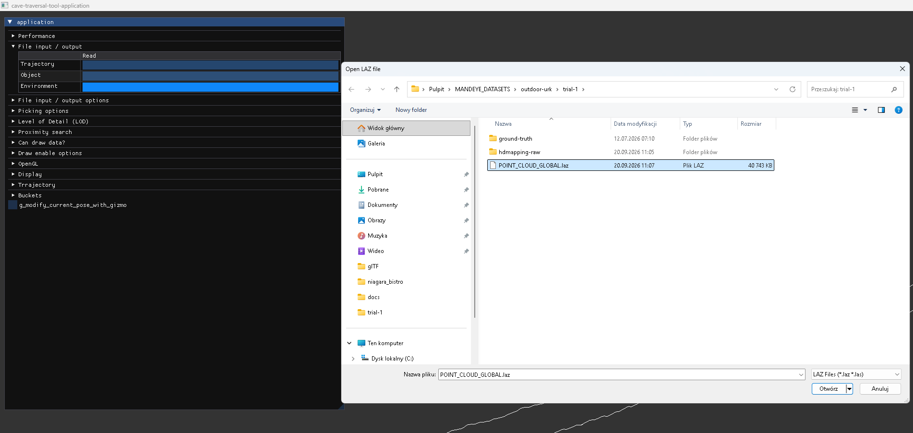
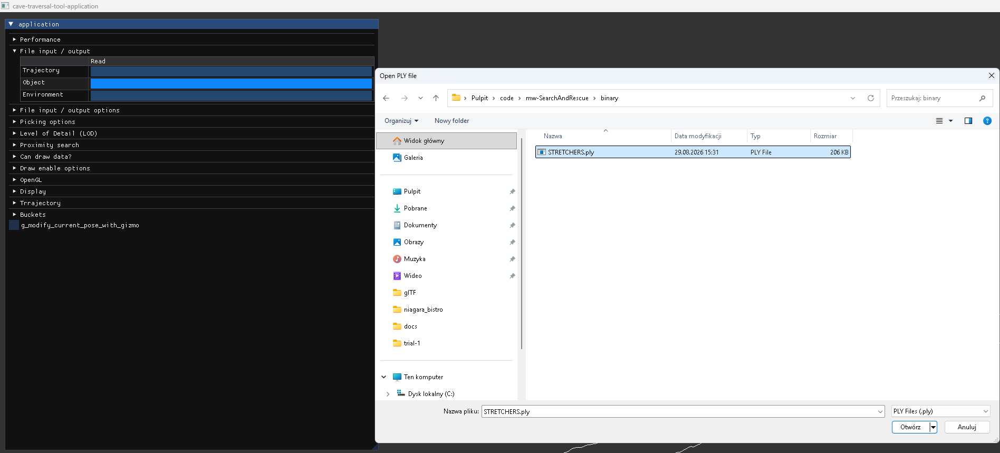
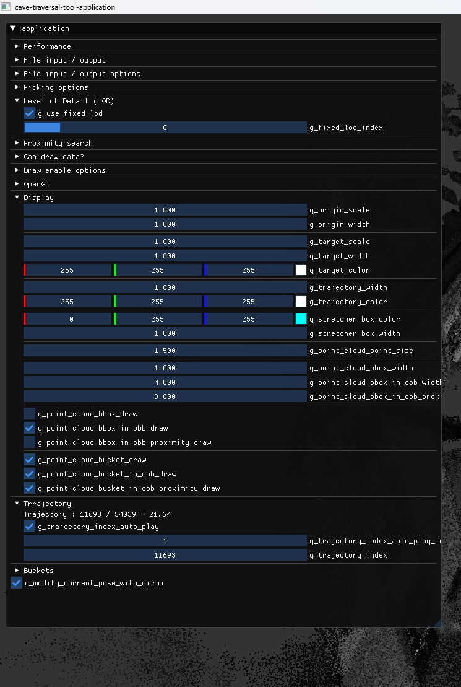
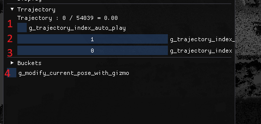

# SearchAndRescue

## Download the data:

You can download data used in this README from [Google drive](https://drive.google.com/drive/folders/18n5jOMeG7KuBFmcrc1OC0CYmQhiqvMrl?usp=sharing)

## Download, build and run:

- NOTE: **assets** directory MUST be in directory that project is ran from - if you wish to run the project by double clicking the built **exe** file you must copy assets **directory** to the location of **cave-traversal-tool.exe**

``` bash
# Download :
git clone --recursive https://github.com/MapsHD/SearchAndRescue.git

# Enter project directory :
cd SearchAndRescue

# Configure project :
cmake -B build -S . -DCMAKE_BUILD_TYPE=Release

# Build :
cmake --build build --config Release -j 8

# Run :
.\build\Release\cave-traversal-tool.exe
```

## Run prebuilt:

``` bash
# Download :
git clone --recursive https://github.com/MapsHD/SearchAndRescue.git

# Enter project directory :
cd SearchAndRescue

# Open *binary* in Windows explorer :
explorer.exe .

# Double click on cave-traversal-tool.exe
```

## Movement:

- __Left mouse button + mouse movement__ - camera rotation
- __Right mouse button + mouse movement__ - moving camera and camera target up / down / left / right in screen space
- __Mouse wheel__ - zoom in / out

## Preparing data:

- Using HDMapping step 1 process the dataset: 



- Using HDMapping step 2 load sesssion (*.mjs) file from step 1 result



- After loading data in step 2 export global point cloud in LAZ format



- After loading data in step 2 export trajectory - format does not matter as it will be adjusted during loading



## Loading data:

- Load trajectory csv file:



- Load environment (global LAZ scan):



- Load object (PLY model) - stretchers model is provided in repository directory __binary__: 



## Traversing trajectory:

- If point cloud seems to sparse use option for fixed LOD:



- In Trajectory section:
    - 1. Enable autoplay - object will move along trajectory N steps every frame
    - 2. N step count
    - 3. Slider to adjust pose index manually (using double left click it can be set using input prompt)
    - 4. Use only when auto play is disabled (it is hard to use guizmo when it is moving) - you can adjust object orientation at current pose to manually fit it into surrounding 

