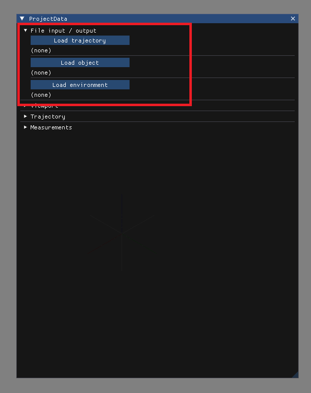

# Loading data:

## Loading using GUI:

In **ProjectData** window open __File input / output__ section and press:
- **Load trajectory** - CSV file
- **Load object** - PLY file
- **Load environment** - LAZ / LAS file

- Load trajectory csv file:

## Loading using drag and drop:

Drag and drop files onto program window ant they will be loaded based on their extensions as described above - if load fails info will be logged in the terminal.