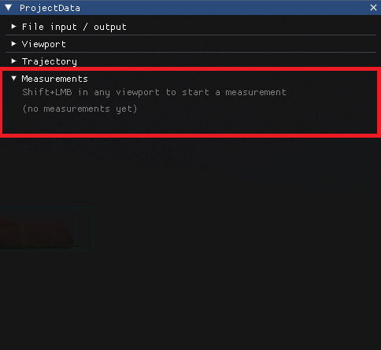
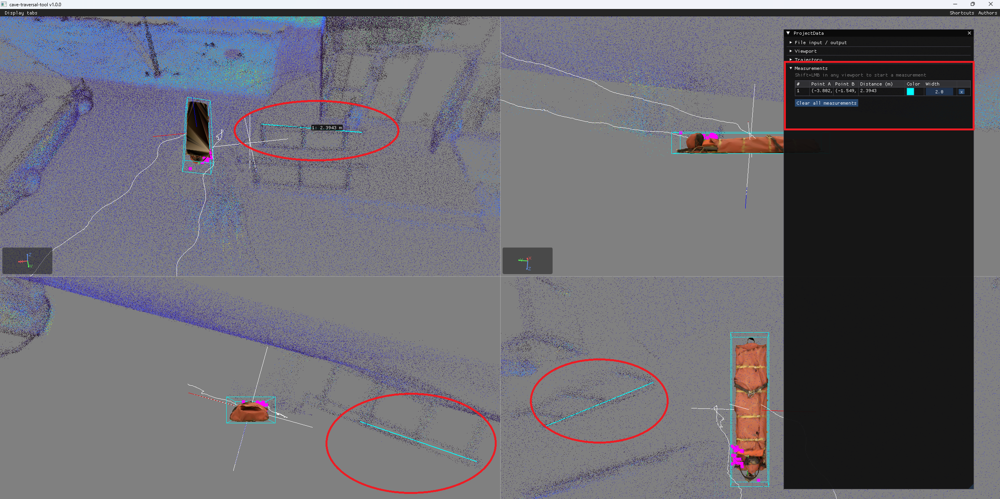

# Measurements

In **ProjectData** window open __Measurements__ section:
- Taken measurements will be displayed there

To take measurement use SHIFT+LMB on any viewport:
- In __Measurements__ section individual measurements can be modified / deleted
- In case of picing wrong measurement point it can be removed in __Measurements__ section by pressing __Cancle pending__
- Measurement lines will be displayed in all viewports and in viewport **1** measurement tag with measured value will be displayed

