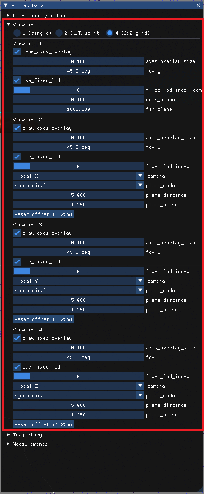

# Multi viewport

In **ProjectData** window open __Viewport__ section:
- Select number of vieports to use (1, 2 or 4)
- Recomended usage:
    - 4 viewports
    - Viewports 2, 3 and 4 use X/Y/Z or local X/Y/Z cameras (for local camera will be snapped to selected axis of current pose orientation, otherwise it will be snapped to selected global coordinate system axis at stretcher pose) 

