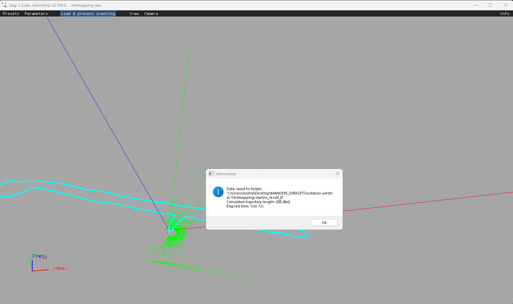
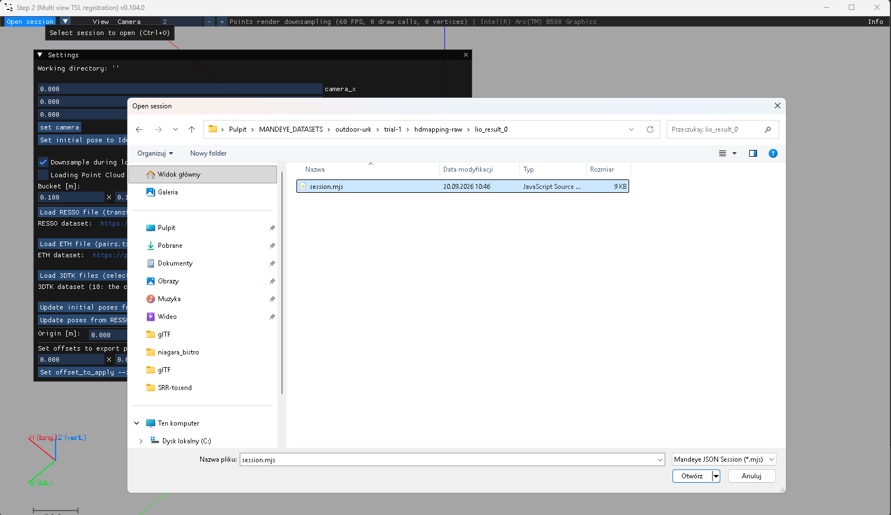
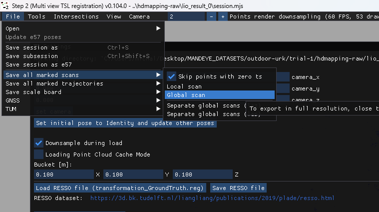
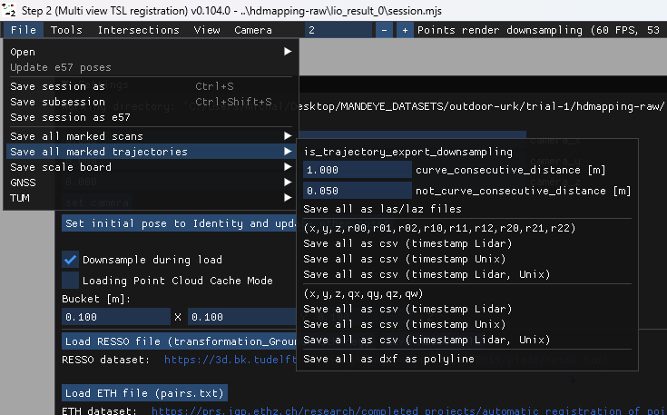

# Preparing data:

- Using HDMapping step 1 process the dataset: 

- Using HDMapping step 2 load sesssion (*.mjs) file from step 1 result

- After loading data in step 2 export global point cloud in LAZ format

- After loading data in step 2 export trajectory - format does not matter as it will be adjusted during loading

