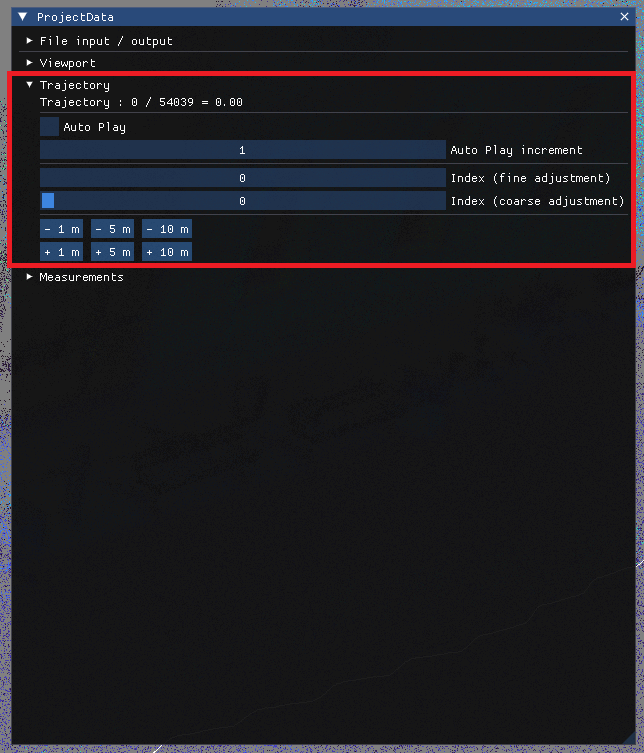

# Traversing trajectory:

In **ProjectData** window open __Trajectory__ section:
- **Auto Play** - enables automatic trajectory traversal - each application frame **object** will move by **Auto Play increment** poses
- **Index (fine adjustment)** and **Index (coarse adjustment)** - can be used to manually set current pose index
- **Six buttons** with distances can be used to move object by **N** meters forward / backward (__clamped by trajectory length__)

